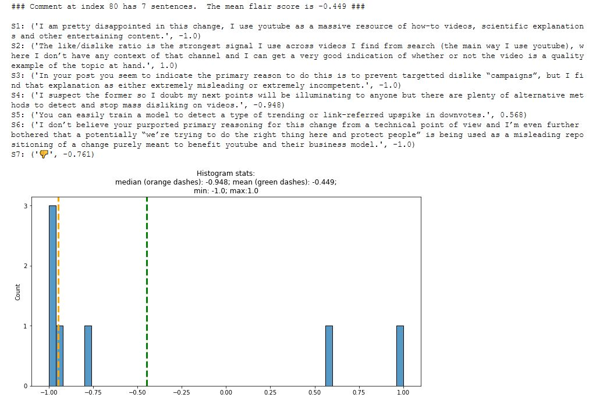
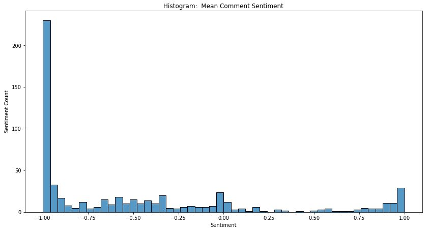
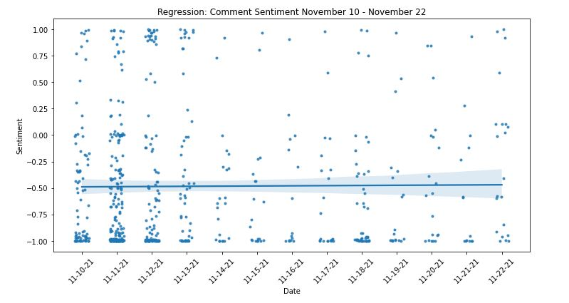

# youtube_dislike_count_removal_sentiment

&nbsp;

### YouTube Dislike Button Remains, with Number of Dislikes Hidden from Public

* On November 10, 2021, YouTube announced that video **dislike counts** will be hidden from the public.  The stated benefit is protecting creators (especially smaller ones) from dislike attacks and harassment.
* The number of dislikes is only available in Studio to content creators.
* Announcement and Comments: https://support.google.com/youtube/thread/134791097/update-to-youtube-dislike-counts?hl=en

***
### Let's Analyze Sentiment for Dislike Button Update!  🧐
The public provided comments on YouTube's dislike change.  Let's score comment sentiment.  This is done on a scale of -1.0  to +1.0 (most negative to most positive sentiment).  We use the distilbert language model from the easy-to-use [flair NLP library](https://github.com/flairNLP/flair) to predict sentiment.

Here is the methodology.  A comment is made of sentences and sentiment is scored for each sentence.  The score is the average sentiment for all sentences (or emoticons) in the comment.  For example, if a comment has seven sentences, then the score is the average of the seven sentiments.  Below is an illustration.

#### <ins>Comment with Seven Sentences/Emoticons:</ins>

---

### Results
There were 613 total comments scored.  The bulk of the comments are negative sentiment.  The median sentiment is -0.739.  So half the comments score below -0.739 and half score above.

#### <ins>Histogram:</ins>

The comments were posted between November 10 and November 22 in 2021.  That is 13 days.  Did sentiment move over time?

Below is the sentiment plot, from comment #1 to comment #613.  The flat regression line reveals that sentiment moved very little between the oldest and newest comments.  Note

#### <ins>Regression of Sentiment vs Comment Number:</ins>

