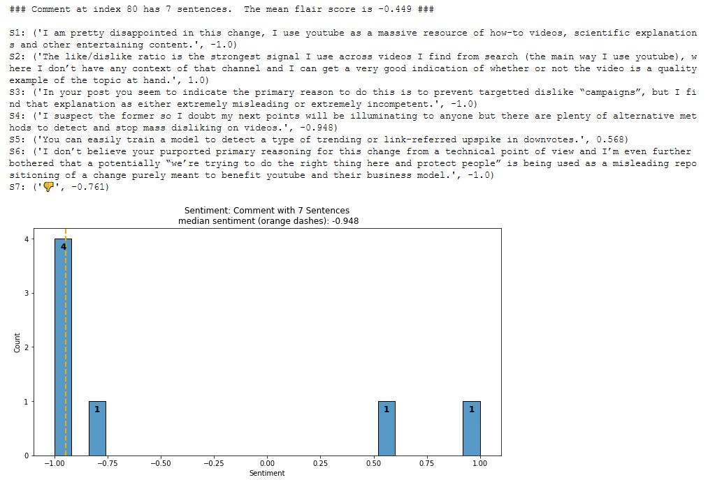
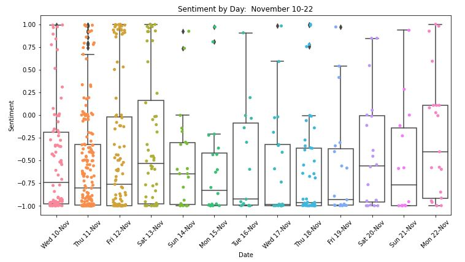

# youtube_dislike_count_removal_sentiment

### YouTube Update: The YouTube Dislike Button Remains, with Number of Dislikes Hidden from Public

* On November 10, 2021, YouTube announced that video **dislike counts** will be hidden from the public.  The stated benefit is protecting creators (especially smaller ones) from dislike attacks and harassment.
* The number of dislikes is only available in Studio to content creators.
* Announcement and Comments: https://support.google.com/youtube/thread/134791097/update-to-youtube-dislike-counts?hl=en

***
### Let's Analyze Sentiment for the Dislike Button Update!  🧐
The public provided comments on YouTube's dislike change.  Let's score comment sentiment.  This is done on a scale of -1.0  to +1.0 (most negative to most positive sentiment).  We use the DistilBERT **[1]** language model from the easy-to-use [flair NLP library](https://github.com/flairNLP/flair) to predict sentiment.

Here is the methodology.  A comment is made of sentences and sentiment is scored for each sentence.  The flair score is the average sentiment for all sentences (or emoticons) in the comment.  For example, if a comment has seven sentences, then the score is the average of the seven sentiments.  Below is an illustration.

#### <ins>Explore Comment Sentiment.  This Comment has Seven Sentences/Emoticons:</ins>

***
### Repo Contents
This repo contains the following:  

&ensp; **(1)** The HTML file with 613 comments on YouTube's announcement (a November 10-22 snapshot).  

&ensp; **(2)** A Jupyter Notebook.  
* Notebook Python code extracts the comments from the webpage.  
* Next, a pipeline prepares and scores the comments.  
* Last, sentiment scores are visualized.

***

### Results
There were 613 total comments scored.  The bulk of the comments are negative sentiment.  The median sentiment is -0.739.  So half the comments score below -0.739 and half score above.  

Recall sentiment goes from -1.0 to 1.0.  Comment sentiment of 0 is neutral.  Comment sentiment is the average of sentence-level predictions by the DistilBERT model.

#### <ins>Histogram:</ins>

The comments were posted between November 10 and November 22 in 2021.  That is 13 days.  How did sentiment change over time?

Below is the sentiment distribution plot for November 10-22.  Each day is overlaid with a boxplot to visualize the median and quartiles.  Each dot is a comment.  We see the most comments were made the first three days.  The median sentiment is relatively consistent these three days around -0.77 +/- 0.03.

For November 10-22, median sentiment fluctuates between a minimum of -0.98 on Nov. 17 and a maximum of -0.41 on Nov. 22.  But, these extremes are each based on less than 30 values.  So they are less reliable.  The law of Large Numbers says more samples bring the estimate closer to the true population value.

#### <ins>Boxplot by Day:</ins>

***
### Final Thoughts
The sentiment classification (flair score) of a sentence may be spot on.  It can also be inaccurate!  Sentence-level noise is mitigated two ways: (1) sentiment is averaged across all sentences in the comment; (2) we assess sentiment across hundreds of comments.

It is possible scoring comments at the phrase level would be effective.  Here we are using DistilBERT's sentence level understanding of a sequence.

Consider YouTube's video announcement.  What do you think about hiding dislike counts -- does it degrade the user experience?
***

#### Footnotes:
**[1]** flair used this version: ~\.flair\models\sentiment-en-mix-distillbert_4.pt
